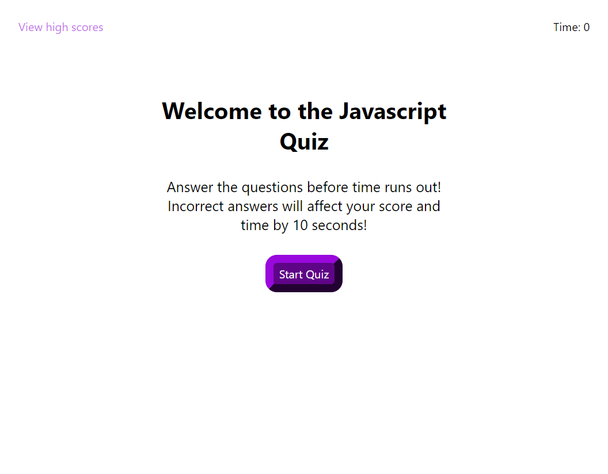

# The Javascript Quiz

## Description

This readme contains information on the Javascript Quiz website that I have created using HTML, CSS, and Javascript. The link to the deployed live site can be found in the "Links" section of this readme. All buttons and links in the deployed website are functioning properly. This Javascript Quiz website contains 5 questions that a user must answer within a specific time frame. The website contains a welcome page, quiz questions, high score submissions, and a quiz complete page. The score and name of the user is set using local storage.

## Installation

N/A

## Usage

In order to use this website, the user must click the start button to begin the quiz. The user is then given a series of 5 questions which must be completed within the time frame. Ten seconds are deducted for each question wrong. At the end of the quiz, the user can submit their score and initials to be recorded in the "High Scores" section.  

## Links

Github repository URL: https://github.com/JarettDeSanti/The_Javascript_Quiz  
Deployed live site URL: https://jarettdesanti.github.io/The_Javascript_Quiz/

## Screenshot

## Acknowledgements

Guidance with this project was given by tutor David Johnson and Jason Stoyles.

## Credits

N/A

## License

Please refer to the LICENSE in the repository.

## Badges
N/A

## Features
N/A

## How to Contribute
N/A

## Tests
N/A
